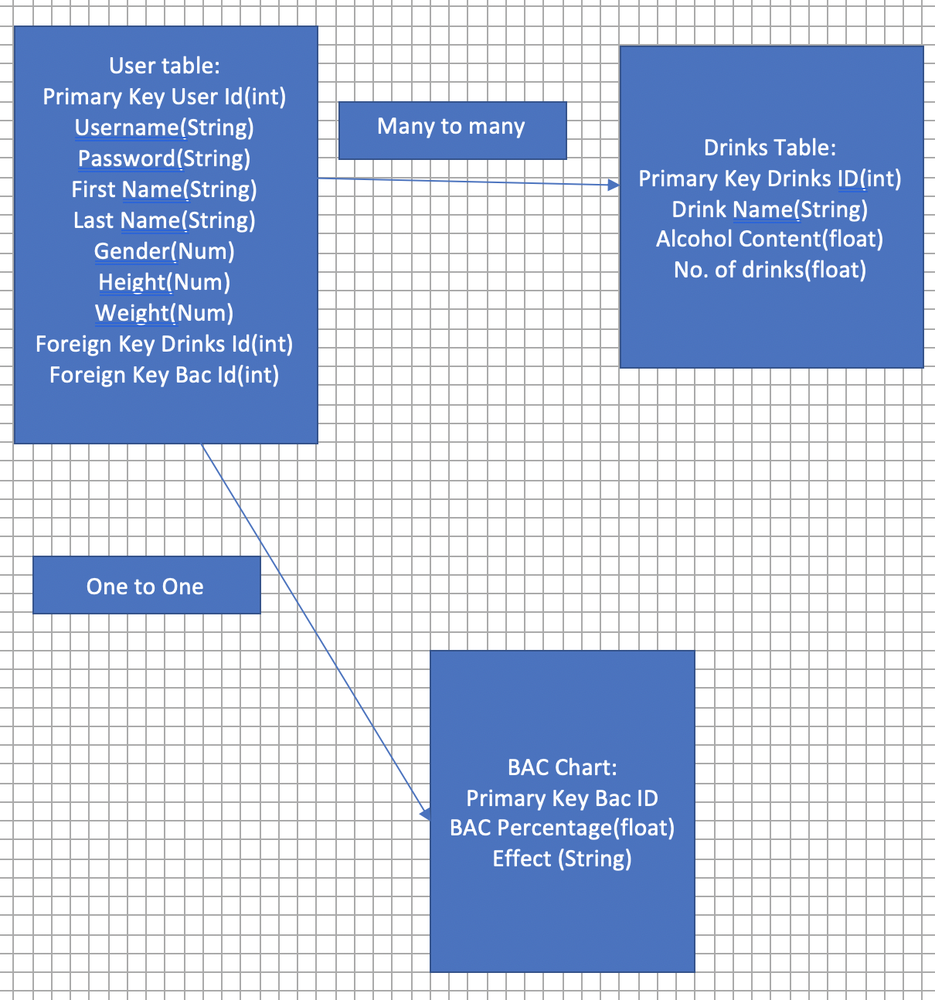
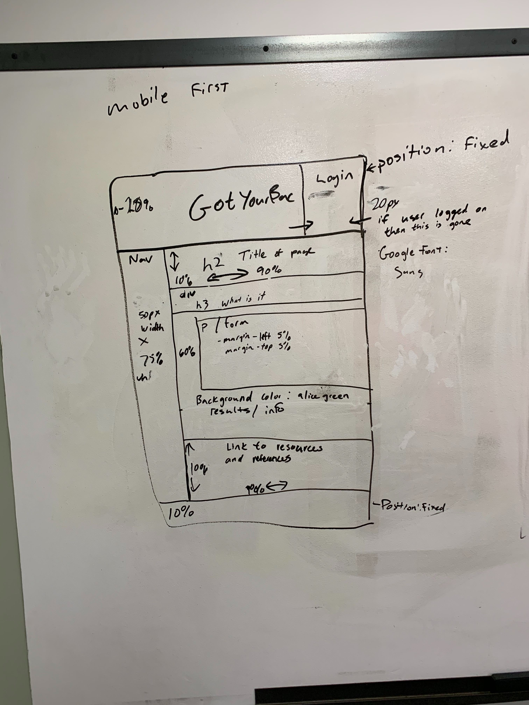
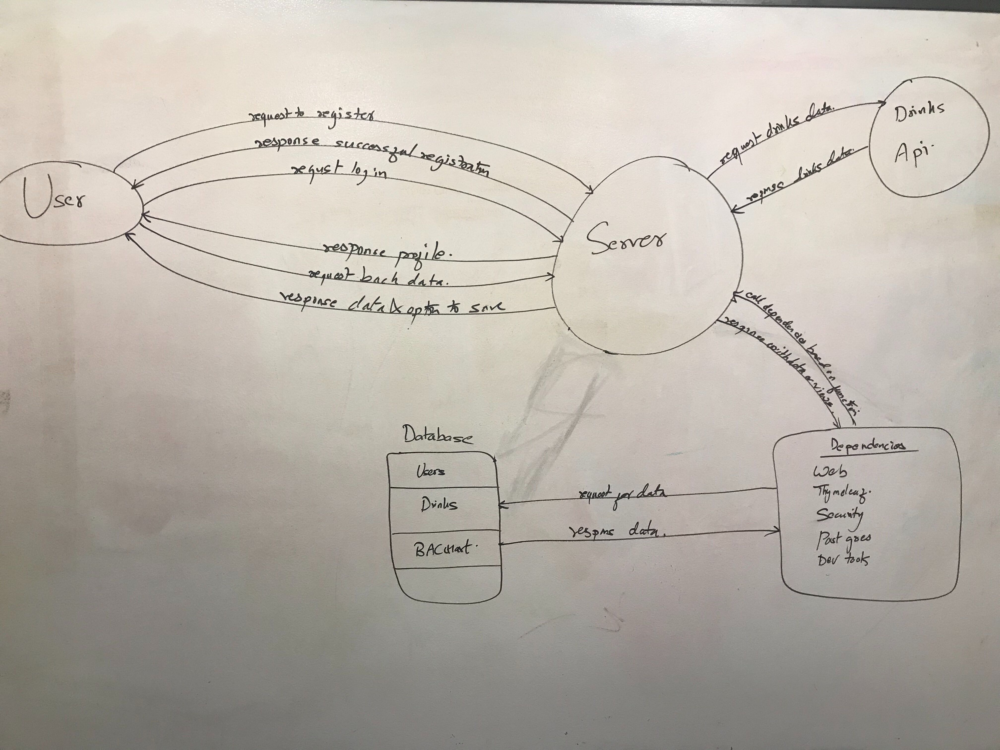
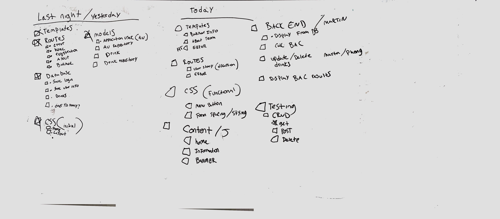
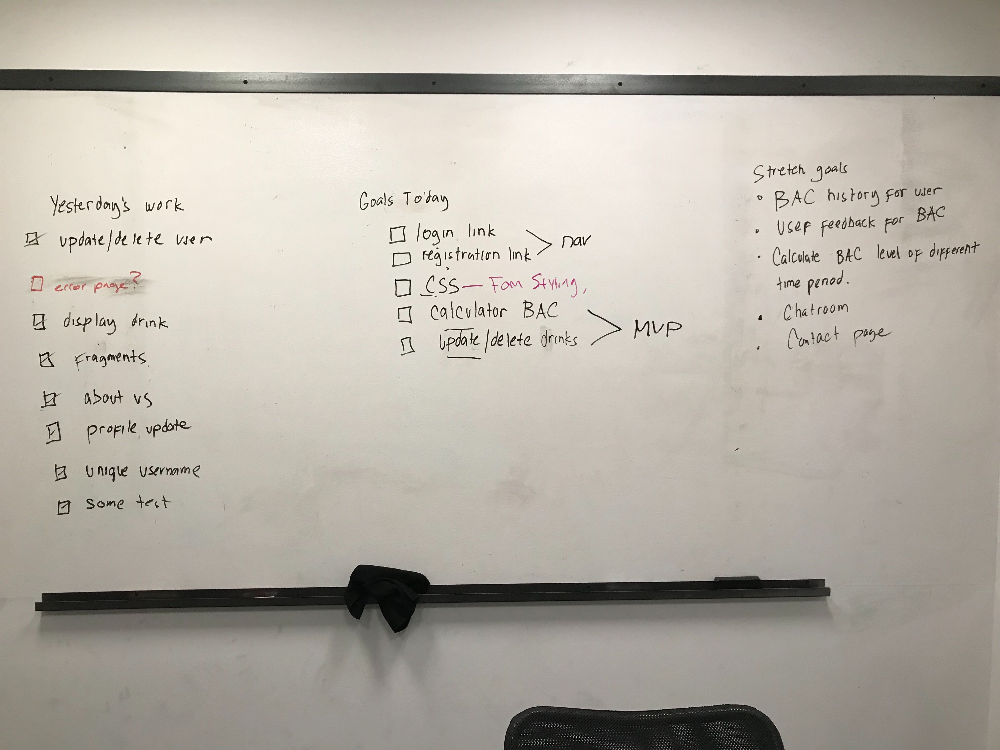

# GotYourBac

## Members:
* Hollie Thomas
* Jitendra Bajracharya
* Phong Doan
* Martin Papa

## Project Goal
* The purpose of this app is to provide users with a blood alcohol content (BAC) estimator.  
* The app will take in and store user data such as height, weight, and age. The user will be able to select drink options to calculate their BAC.  Information to help the user track when their reach their "ballmer peak", an estimated BAC level researched by Microsoft to help developers find their peak BAC for developing
* Minimum MVP would be for a user to select drink options from a menu list and be returned with an estimated BAC .

[Link to Trello](https://trello.com/b/1XmX43HL)

## Database Entity Relationship Diagram
Users and the drinks have many to many relationship because one user can have more than one type of drinks and many user can have the same drink. 
BAC level are unique to each individual so they have one to one relationship.

## WireFrame
This wireframe provides the structure for the rest of the pages in our website

## Domain Modeling

## Work Flow 
### Day 2

### Day 3

## Setup instructions

- On terminal, type `psql`
- type `CREATE DATABASE gotyourbac;`
- Edit Configuration for the App on the top mid right dropdown menu.
- In the Environment Variable:
    - type `DATABASE_URL=postgresql://localhost:5432/gotyourbac`

